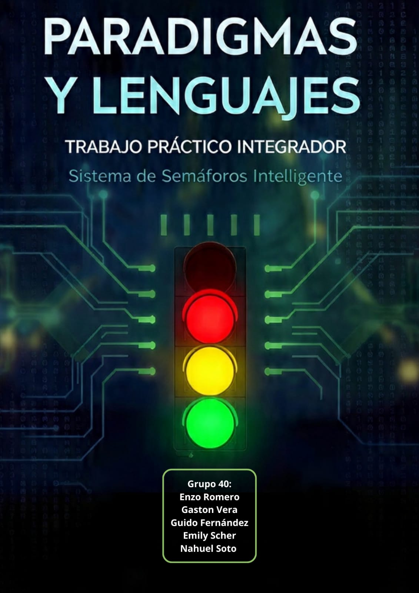

  

---Sistema de Semáforos Inteligentes---

Trabajo Práctico Integrador 2026

Materia: Paradigmas y Lenguajes de Programación

(Grupo 40)

---Integrantes---

* Enzo Fabian Romero 
* Guido Sebastián Fernández Casado
* Gaston Emanuel Vera
* Nahuel Federico Soto
* Emily Giuliana Scher

---

---Descripción---

Desarrollo de un sistema de semáforos inteligentes utilizando programación funcional en Common Lisp y un análisis comparativo con Scala.

---

---Tecnologías Utilizadas---

* Common Lisp
* Scala
* Git
* GitHub

---

---Estructura del Proyecto---

TPI-Funcional-2026-Grupo[40]/
├── lisp/
│ ├── core.lisp <-- Código de los requerimientos 1 al 6 en Common
Lisp (con comentarios de tipo)
│ └── config.json <-- Archivo de configuración (si eligieron cl-json
en Fase 2)
├── comparativa/
│ └── solución.[ext] <-- Código en el lenguaje asignado (con comentarios
de tipo según su sintaxis)
├── docs/
│ ├── INFORME.pdf <-- Informe conceptual con las respuestas analíticas
│ └── HONOR.md <-- Declaración obligatoria de Código de Honor
└── README.md <-- Portada del repositorio y enlaces a los videos

---

Estado del Proyecto
ya realizado
_ Repositorio creado
_Integrantes incorporados
_Primeros commits realizados
-Edición del Readme para iniciar proyecto

_Desarrollo de la Fase 1
_Integración de librerías (Fase 2)
_Implementación en Scala (Fase 3)
_requerimientos 1 al 6 terminado con exito.

En Proceso

_Informe final
_Video de presentación

---Repositorio----

Repositorio oficial del grupo para el desarrollo y seguimiento del Trabajo Práctico Integrador 2026.
